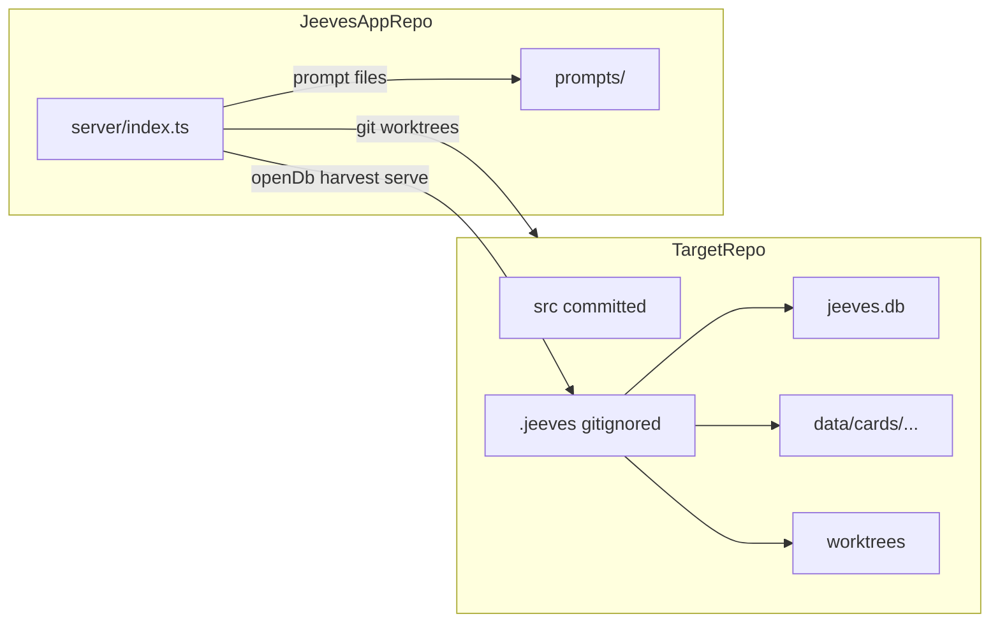
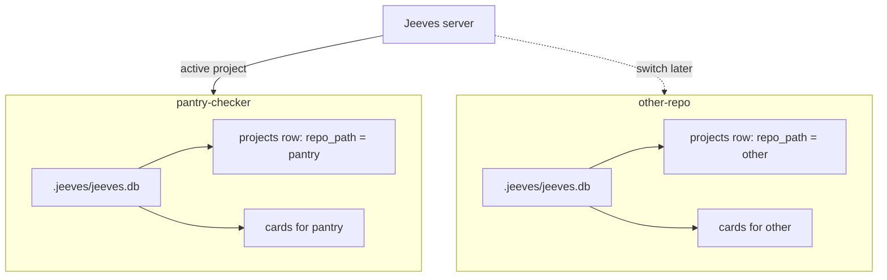

# Project store implementation (ADR 0011)

## Goal

When Jeeves starts pointed at a target repo (`JEEVES_REPO_PATH`), it creates and uses a **project store** at `<repo>/.jeeves/`:



**Out of scope for v1:** multi-project picker UI, auto-migration from legacy `jeeves/data/` (fresh start — delete old `data/` manually if needed), committing `.jeeves/` to git.

Docs and vocabulary are already updated ([ADR 0011](docs/adr/0011-project-store-in-target-repo-gitignored.md), [ARCHITECTURE.md](ARCHITECTURE.md), [CONTEXT.md](CONTEXT.md)).

---

## Current vs target wiring

Today [`server/index.ts`](server/index.ts) hardcodes app-local paths:

```ts
const dataDir = path.join(rootDir, "data");
const dbPath = process.env.JEEVES_DB_PATH ?? path.join(dataDir, "jeeves.db");
const repoPath = process.env.JEEVES_REPO_PATH ?? rootDir;
const worktreeRoot = process.env.JEEVES_WORKTREE_ROOT ?? path.join(dataDir, "worktrees");
const artifacts = new ArtifactStore(db, dataDir);
```

Target bootstrap:

```ts
const repoPath = resolve(process.env.JEEVES_REPO_PATH ?? rootDir);
const paths = ensureProjectStore(repoPath); // creates .jeeves/, appends .gitignore
const db = openDb(paths.dbPath);
const artifacts = new ArtifactStore(db, paths.artifactRoot);
const worktrees = new WorktreeManager({ repoPath: paths.repoPath, worktreeRoot: paths.worktreeRoot });
```

**Unchanged:** `ExecutionEngine.repoRoot` stays the **Jeeves app root** (prompt files live in `prompts/execution/`). `CardStore.getRepoPath(cardId)` already returns the target repo for agent `cwd`.

---

## 1. New module: `server/project-store.ts`

Add the deep module sketched in [jeeves-project-structure.md](docs/plans/jeeves-project-structure.md).

**Exports:**

| Symbol | Responsibility |
|--------|----------------|
| `ProjectStorePaths` | `{ repoPath, storeRoot, dbPath, artifactRoot, worktreeRoot }` |
| `resolveProjectStorePaths(repoPath)` | Derive paths; honour `JEEVES_DB_PATH` / `JEEVES_WORKTREE_ROOT` overrides per ADR |
| `ensureProjectStore(repoPath)` | `mkdir -p` store layout + `ensureGitignoreEntry(repoPath)` |

**Path rules** (from ADR):

- `storeRoot` = `<repo>/.jeeves`
- `dbPath` = `JEEVES_DB_PATH` ?? `<storeRoot>/jeeves.db`
- `artifactRoot` = `<storeRoot>/data`
- `worktreeRoot` = `JEEVES_WORKTREE_ROOT` ?? `<storeRoot>/worktrees`

**`ensureGitignoreEntry`:**

- Read `<repo>/.gitignore` (create file if missing)
- Append `.jeeves/` only if no existing line matches (trimmed, allow `#` comments)
- Never rewrite unrelated rules

**Tests:** [`server/project-store.test.ts`](server/project-store.test.ts) using temp dirs — path resolution, directory creation, gitignore idempotency, env overrides.

---

## 2. Rewire server bootstrap

**[`server/index.ts`](server/index.ts)**

1. Resolve `repoPath` from `JEEVES_REPO_PATH` (default: Jeeves app root).
2. Call `ensureProjectStore(repoPath)` before `openDb`.
3. Pass `paths.artifactRoot` to `ArtifactStore` and `ExecutionEngine.artifactRoot`.
4. Pass `paths.repoPath` + `paths.worktreeRoot` to `WorktreeManager`.
5. Keep `repoRoot: rootDir` on `ExecutionEngine` (Jeeves prompts).

**[`server/execution/worktree-manager.ts`](server/execution/worktree-manager.ts)**

- Update `resolveWorktreeRoot` default from `baseDir/data/worktrees` → `path.join(repoPath, '.jeeves', 'worktrees')`.
- Prefer explicit `worktreeRoot` from caller (index will always pass it); keep `baseDir` only as legacy fallback or remove if unused after index change.
- Update file-level comment to reference ADR 0011.

**No changes needed** to [`server/artifacts/store.ts`](server/artifacts/store.ts) harvest logic — it already takes an `artifactRoot` and uses `cards/<cardId>/…` beneath it.

---

## 3. Tooling and repo hygiene

**[`drizzle.config.ts`](drizzle.config.ts)**

- Import `resolveProjectStorePaths` (or duplicate minimal logic) so `db:generate` targets `<repo>/.jeeves/jeeves.db` when `JEEVES_REPO_PATH` is set.
- Default when unset: resolve against `process.cwd()` (Jeeves repo root).

**[`.gitignore`](.gitignore)** (Jeeves app repo)

- Add a short comment that `data/` is **legacy** (pre-ADR-0011); keep rules so old local folders stay ignored.
- No functional change required in pantry-checker — Jeeves appends `.jeeves/` on first boot.

**[`drizzle.config.ts`](drizzle.config.ts) / dev workflow**

- After implementation, dogfood with `JEEVES_REPO_PATH=../jeeves-test-pantry-checker` in [`.env`](.env).

---

## 4. Tests to adjust

Most tests use `:memory:` DB and temp `artifactRoot` — **unchanged**.

| File | Change |
|------|--------|
| [`server/project-store.test.ts`](server/project-store.test.ts) | **New** — primary coverage for this slice |
| [`server/execution/worktree-manager.test.ts`](server/execution/worktree-manager.test.ts) | Optional: one test that default resolution uses `<repo>/.jeeves/worktrees` when `worktreeRoot` omitted |
| [`server/execution/engine.test.ts`](server/execution/engine.test.ts) | No production-path change; `fakeWorktrees` stays self-contained |

Run `npm test` and `npm run spike:sdk -- --phase run` against pantry-checker target to verify Plan harvest still works end-to-end.

---

## 5. Pre-existing caveat (document in PR, not code)

[`CardStore.ensureDefaultProject`](server/cards/store.ts) seeds **once** — the first `repo_path` wins forever in that DB. After switching to pantry-checker:

- A **new** `.jeeves/jeeves.db` is created in the target repo (fresh DB).
- If you accidentally boot once against the wrong path, that project's DB is pinned — delete `<repo>/.jeeves/` and restart.

Multi-project switching is a future slice; this implementation only needs correct paths for the single active project.

---

## 6. Verification checklist

1. Set `JEEVES_REPO_PATH` to pantry-checker; start server.
2. Confirm `<pantry>/.jeeves/{jeeves.db,data/,worktrees/}` created and `<pantry>/.gitignore` contains `.jeeves/`.
3. Create a card, run Plan step — exchange file harvested to `<pantry>/.jeeves/data/cards/<id>/0/plan/…`.
4. Worktree appears under `<pantry>/.jeeves/worktrees/<id>/`, not `jeeves/data/worktrees/`.
5. `npm test` — all green.
6. Delete legacy `jeeves/data/` manually when satisfied (no migrator).

---

## File touch list

| Action | File |
|--------|------|
| Create | `server/project-store.ts`, `server/project-store.test.ts` |
| Modify | `server/index.ts`, `server/execution/worktree-manager.ts`, `drizzle.config.ts`, `.gitignore` (comment only) |
| Doc | `docs/plans/jeeves-data-model.md` — "Project store derivation" subsection |

No schema migration — same SQLite tables, new file location.

---

## 7. Data model: `repo_path` stays (clarify in docs)

[`jeeves-data-model.md`](docs/plans/jeeves-data-model.md) already has rule #3 and an updated `repo_path` column comment. **No schema change** for this slice — `repo_path` remains the right field.

### Why `repo_path` is still correct

| Concern | Role of `repo_path` |
|---------|---------------------|
| Git / worktrees | `WorktreeManager` uses it as the target repository root |
| Project store | Derives `<repo_path>/.jeeves/{jeeves.db,data/,worktrees/}` — paths are **not** duplicated as DB columns |
| Agent `cwd` | `CardStore.getRepoPath(cardId)` joins `cards → projects.repo_path` |
| Future repo switcher | Each registered project is a `repo_path`; switching projects reopens that repo's `.jeeves/jeeves.db` and artifact root |

### One DB per target repo (ADR 0011)



- Each target repo owns an isolated SQLite file at `<repo>/.jeeves/jeeves.db`.
- The `projects` table inside that file describes **that** repo (`repo_path`, `name`, `preview_config`, `default_branch`).
- v1 bootstraps one project via `JEEVES_REPO_PATH` + `ensureDefaultProject`; a future switcher lists known `repo_path` values and swaps which `.jeeves/jeeves.db` is open — it does **not** need a global mega-database.

### Doc addition (small)

Add a **"Project store derivation"** subsection to [`jeeves-data-model.md`](docs/plans/jeeves-data-model.md) after the `projects` table block:

- Explicit path derivation table (`repo_path` → `jeeves.db`, `data/`, `worktrees/`)
- Note: store paths are computed at runtime by `ProjectStore`, never stored as columns
- Future switcher: selects active `repo_path`, server rebinds DB + `ArtifactStore` + `WorktreeManager`
- v1: single active project only; schema already supports the per-repo model

**Not needed:** `store_path` or `db_path` columns on `projects` — that would duplicate `repo_path` and drift if the repo moves.

