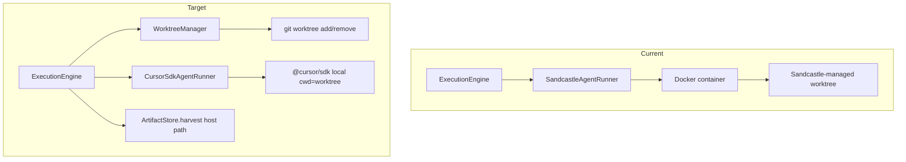
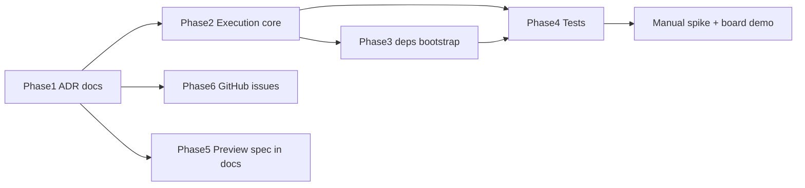

# Sandcastle → SDK + Worktrees Migration Plan

Reference plan for migrating Jeeves off Sandcastle/Docker execution. **Spike validation is complete** (PARTIAL GO): worktrees, SDK local runs, streaming logs, uncommitted `.jeeves/plan.md` harvest, and cancel all work on native Windows; SDK native sandbox is **unavailable** on this host — run without `sandboxOptions.enabled`.

---

## Validated spike (done — do not redo)


| Artifact                                                           | Purpose                |
| ------------------------------------------------------------------ | ---------------------- |
| `[.scratch/spike-sdk-worktree.ts](.scratch/spike-sdk-worktree.ts)` | Repeatable gate script |
| `[npm run spike:sdk](package.json)`                                | Convenience entry      |
| `[.scratch/spike-sdk-results.md](.scratch/spike-sdk-results.md)`   | Last run output        |
| `[.scratch/harvest/plan.md](.scratch/harvest/plan.md)`             | Proof of harvest       |


**Production implications from spike:**

- Use `@cursor/sdk` with `local: { cwd: worktreePath, settingSources: [] }` — no sandbox on native Windows
- Jeeves owns run log persistence (tee `run.stream()` → file); Sandcastle's `logging.type: "file"` goes away
- After `run.cancel()`, treat `ConnectError: [canceled]` on `run.wait()` / dispose as success
- Branch naming: `jeeves/card-<id>` (not per-step suffix); durable branch, ephemeral worktree per run

---

## Target architecture




**Unchanged seams:** `[AgentRunner](server/execution/runner.ts)` interface, `[ExecutionEngine](server/execution/engine.ts)` queue/SSE, slices 1–2 client/board code, ACP chat path (slice 5).

---

## Phase 1 — Decision record and docs

### New ADR

Create `[docs/adr/0010-self-managed-worktrees-cursor-sdk.md](docs/adr/0010-self-managed-worktrees-cursor-sdk.md)`:

- **Supersedes** Sandcastle + Docker as the execution path (portions of ADR 0008 consequences)
- **Decision:** Jeeves owns git worktree lifecycle; `@cursor/sdk` is the `AgentRunner` implementation; no Docker for agent runs
- **Sandbox:** not required on native Windows; optional `sandboxOptions.enabled` when host supports it (WSL/Linux/macOS)
- **Preview:** host-process dev servers (reverses ADR 0009's earlier Docker requirement); Jeeves-owned env allowlist still applies. **Docker-isolated preview containers remain a valid future option** if host-process trust becomes a concern — decided against for now to avoid retaining Docker complexity after removing it from agent runs.
- **Spike reference:** link to `.scratch/spike-sdk-worktree.ts` and PARTIAL GO verdict

### Update existing ADRs


| ADR                                                                                                              | Change                                                                                                                                                                                                                                                                                    |
| ---------------------------------------------------------------------------------------------------------------- | ----------------------------------------------------------------------------------------------------------------------------------------------------------------------------------------------------------------------------------------------------------------------------------------- |
| `[docs/adr/0008-ai-sdk-assistant-ui-agent-runner.md](docs/adr/0008-ai-sdk-assistant-ui-agent-runner.md)`         | Replace "Sandcastle + cursor" with `@cursor/sdk` local; note HarnessAgent remains future optional path                                                                                                                                                                                    |
| `[docs/adr/0009-branches-durable-worktrees-ephemeral.md](docs/adr/0009-branches-durable-worktrees-ephemeral.md)` | Replace Docker preview section with host-process preview; update "Considered options" — host previews now **accepted**; record **Docker preview containers as rejected-for-now alternative** (stronger isolation for AI-written code, but adds Docker back as a permanent dev dependency) |


### Update top-level docs


| File                                 | Sections to revise                                                                                                                                                                                              |
| ------------------------------------ | --------------------------------------------------------------------------------------------------------------------------------------------------------------------------------------------------------------- |
| [`docs/plans/jeeves-plan.md`](../../docs/plans/jeeves-plan.md)   | Architecture diagram, tech stack table, execution engine description, worktree/preview sections, project structure (`.sandcastle/` → `prompts/`), slice 3 notes, "Resolved: Cursor Docker auth", open questions |
| `[ARCHITECTURE.md](ARCHITECTURE.md)` | System context, tech stack, AI execution layer, module map file names                                                                                                                                           |
| `[CONTEXT.md](CONTEXT.md)`           | **Preview** definition (host process, not Docker container); **Harvest** (host worktree, not sandbox)                                                                                                           |
| `[README.md](README.md)`             | Prerequisites: git, `CURSOR_API_KEY`; remove Docker Desktop requirement; add spike command                                                                                                                      |
| `[.env.example](.env.example)`       | Reword `CURSOR_API_KEY` for SDK/CLI auth (not Sandcastle Docker)                                                                                                                                                |


---

## Phase 2 — Execution core (replace Sandcastle)

### New modules

`**[server/execution/worktree-manager.ts](server/execution/worktree-manager.ts)**` (new)

Responsibilities (extract from spike + ADR 0009):

- `create(cardBranch, baseSha, worktreePath)` — `git worktree add -B …`
- `remove(worktreePath)` — `git worktree remove --force`
- `captureDiagnostics(cwd)` — `status --porcelain`, `diff`, `diff --cached`, `rev-parse HEAD`
- `cleanupOrphans()` — boot-time labeled orphan worktree cleanup
- Configurable root: e.g. `data/worktrees/` or `JEEVES_WORKTREE_ROOT`

`**[server/execution/cursor-sdk-runner.ts](server/execution/cursor-sdk-runner.ts)**` (new, replaces sandcastle-runner)

```typescript
// Shape (not final code)
Agent.create({
  apiKey, model: { id: "composer-2.5" },
  local: { cwd: worktreePath, settingSources: [] },
});
// stream → RunEvent { type: "log" }
// tee to options.logPath
// cancel via run.cancel() + safe dispose
// NO sandboxOptions on Windows
```

**Extend `[server/execution/runner.ts](server/execution/runner.ts)`**

Add to `RunAgentOptions`:

- `worktreePath: string`
- `baseSha: string`
- `onFinalize?: (ctx: { workspacePath, headSha, baseSha }) => Promise<void>`

Keep interface stable so `ExecutionEngine` tests still mock `AgentRunner`.

### Modify existing execution files


| File                                                                             | Changes                                                                                                                                                                                                      |
| -------------------------------------------------------------------------------- | ------------------------------------------------------------------------------------------------------------------------------------------------------------------------------------------------------------ |
| `[server/execution/engine.ts](server/execution/engine.ts)`                       | Orchestrate WorktreeManager → runner → finalize callback; branch `jeeves/card-<id>`; move prompts to `prompts/execution/`; retire commit-based success (`commits > 0`); step postconditions stub for slice 4 |
| `[server/index.ts](server/index.ts)`                                             | Wire `CursorSdkAgentRunner` + `WorktreeManager`; remove `SandcastleAgentRunner` import                                                                                                                       |
| `[server/execution/sandcastle-runner.ts](server/execution/sandcastle-runner.ts)` | **Delete** after cursor-sdk-runner lands                                                                                                                                                                     |


### Prompt relocation

Move `[.sandcastle/prompts/slice-3-tracer.md](.sandcastle/prompts/slice-3-tracer.md)` → `[prompts/execution/slice-3-tracer.md](prompts/execution/slice-3-tracer.md)` (or keep tracer temporarily, replace with plan prompt in slice 4).

Future prompts (slice 4+): all under `prompts/execution/`, not `.sandcastle/prompts/`.

---

## Phase 3 — Dependencies and dev bootstrap


| Action           | Detail                                                                                                                                                                                                     |
| ---------------- | ---------------------------------------------------------------------------------------------------------------------------------------------------------------------------------------------------------- |
| Remove           | `@ai-hero/sandcastle` from `[package.json](package.json)` dependencies                                                                                                                                     |
| Promote          | `@cursor/sdk` from devDependencies → **dependencies**                                                                                                                                                      |
| Regenerate       | `package-lock.json`                                                                                                                                                                                        |
| Rewrite          | `[scripts/dev-guard.ts](scripts/dev-guard.ts)` — drop Docker/image checks; verify `CURSOR_API_KEY`, git available, optional SDK smoke hint                                                                 |
| Delete           | `[.sandcastle/Dockerfile](.sandcastle/Dockerfile)`, `[.sandcastle/main.ts](.sandcastle/main.ts)`, `[.sandcastle/.env.example](.sandcastle/.env.example)`, `[.sandcastle/prompt.md](.sandcastle/prompt.md)` |
| Update           | `[.gitignore](.gitignore)` — replace `.sandcastle/worktrees/` with `data/worktrees/` (or chosen worktree root)                                                                                             |
| One-time cleanup | Remove local `sandcastle:jeeves` Docker image; prune stale `spike/*` branches/worktrees                                                                                                                    |


Keep `[npm run spike:sdk](package.json)` as regression gate (optional post-migration).

---

## Phase 4 — Tests


| File                                                                 | Changes                                                                                                                                       |
| -------------------------------------------------------------------- | --------------------------------------------------------------------------------------------------------------------------------------------- |
| `[server/execution/engine.test.ts](server/execution/engine.test.ts)` | Branch expectation `jeeves/card-<id>` (no `/plan` suffix); prompt path; remove "docker exploded" fixture; fake runner supplies `worktreePath` |
| **New** `server/execution/worktree-manager.test.ts`                  | Temp git repo: create/remove worktree, diagnostics, no host checkout leak                                                                     |
| **New** (optional) `server/execution/cursor-sdk-runner.test.ts`      | Mock SDK boundary; real SDK = manual only                                                                                                     |


**Unchanged:** slices 1–2 `[server/cards/store.test.ts](server/cards/store.test.ts)` — regression only.

Manual demo (replaces Sandcastle Docker demo): `Implement now →` on board, watch Plan stream, verify no `.sandcastle`/`hello.txt` debris.

---

## Phase 5 — Preview policy (host-process, spec now / impl slice 9)

Per your choice: **update ADR/plan now**; implement `PreviewManager` when building slice 9.

### Considered alternative: Docker preview containers (rejected for now)

The original [`docs/plans/jeeves-plan.md`](../../docs/plans/jeeves-plan.md) and ADR 0009 specified **Docker-isolated preview servers** for Human Review — recreating the evaluated SHA in a container with Jeeves-owned image/setup/dev commands, published port, and env allowlist. That approach preserves a stronger trust boundary when running AI-written dependency scripts during manual testing.

**Why it was considered:** executing reviewed code in a container limits blast radius if a dev-server script or `postinstall` hook misbehaves.

**Why it was rejected for now:**

- Removing Docker from agent runs was the primary simplification goal; keeping Docker only for previews would still require Docker Desktop, image maintenance, and port/container lifecycle code on every dev machine.
- For a personal tool reviewing your own AI's output on your own repos, host-process previews with a strict Jeeves-owned env allowlist are an acceptable trade-off.
- Host-process previews reuse the same `WorktreeManager` + worktree-at-SHA pattern without a second isolation layer.

**Future escape hatch:** if preview trust becomes a concern, `PreviewManager` can be reimplemented behind the same `ExecutionEngine.startPreview` / `stopPreview` seam using Docker without touching agent execution. Document this in ADR 0010 as a deferred option, not the v1 path.

### Schema / config (define in plan + ADR, implement with slice 9)

Replace Docker fields in `projects.preview_config` with host-process shape:

```json
{
  "setupCommand": "npm install",
  "devCommand": "npm run dev",
  "port": 5173,
  "readinessPath": "/",
  "readinessTimeoutMs": 30000,
  "envAllowlist": ["NODE_ENV", "PORT"]
}
```

No `image` / `dockerfile` fields.

### Planned module (slice 9)

`[server/execution/preview-manager.ts](server/execution/preview-manager.ts)` (not built in this migration):

- Recreate worktree at evaluation `git_sha`
- Spawn `devCommand` as child process on allocated port (`0.0.0.0` for Tailscale)
- Readiness HTTP probe; single lazy-retained slot; kill process tree on Stop
- Shared port allocator with Playwright screenshot capture (slice 11)

Update [`docs/plans/jeeves-plan.md`](../../docs/plans/jeeves-plan.md) Human Review preview section accordingly.

---

## Phase 6 — GitHub issues

### New issue (prerequisite)

**"Runtime migration: Sandcastle → SDK + worktrees"** — blocks slice 4 work; checklist = Phases 2–4 above.

### Update open slice 4 issues


| Issue                                                       | Key replacements                                                                                                   |
| ----------------------------------------------------------- | ------------------------------------------------------------------------------------------------------------------ |
| [#8](https://github.com/RobinopdeBeek/jeeves/issues/8) Spec  | Remove Sandcastle/finalization-via-Sandcastle language; host worktree harvest; no Docker manual demo               |
| [#9](https://github.com/RobinopdeBeek/jeeves/issues/9) 4A   | `CursorSdkAgentRunner`; `WorktreeManager.createWorktree()`; prompt path; fake runner creates temp dir as workspace |
| [#10](https://github.com/RobinopdeBeek/jeeves/issues/10) 4B | Remove "real Sandcastle outside CI" wording → "real SDK outside CI"                                                |
| [#11](https://github.com/RobinopdeBeek/jeeves/issues/11) 4C | Finalization owned by ExecutionEngine on host path (not Sandcastle callback)                                       |
| [#12](https://github.com/RobinopdeBeek/jeeves/issues/12) 4D | Retry recreates via WorktreeManager from recorded `base_sha`                                                       |


### Closed issues (historical)

[#5](https://github.com/RobinopdeBeek/jeeves/issues/5), [#6](https://github.com/RobinopdeBeek/jeeves/issues/6): add comment linking to ADR 0010 + migration issue; do not rewrite bodies.

---

## Phase 7 — Agent skills (when wiring slice 4+)

No Sandcastle references today. Update when connecting skills:


| Skill                                                                    | When                                                |
| ------------------------------------------------------------------------ | --------------------------------------------------- |
| `[prompts/execution/to-tasks.md](prompts/execution/to-tasks.md)` | Slice 7 — document `.jeeves/to-tasks.json` sidecar |
| `[.agents/skills/implement/SKILL.md](.agents/skills/implement/SKILL.md)` | Slice 8 — worktree checkout assumptions             |


Optional: add repo skill documenting worktree layout + exchange paths.

---

## Implementation order (recommended)




1. **ADR 0010 + doc updates** (establishes source of truth before code churn)
2. `**WorktreeManager` + tests** (no network)
3. `**CursorSdkAgentRunner` + `ExecutionEngine` wiring**
4. **Remove Sandcastle, update dev-guard, package.json**
5. **Fix tests + manual board demo**
6. **Update GitHub issues #8–#12**
7. **Preview host-process spec** in plan/ADR (implementation deferred to slice 9)

---

## Explicitly unchanged

- Slices 1–2: board, `CardStore`, `PipelineEngine`, kind decision UI
- Chat stack: ACP bridge (slice 5) — separate from execution migration
- SSE / run log UI / `runs` table pattern
- Artifact-outside-repo strategy (ADR 0007)
- Five deep modules seam (ADR 0006)

---

## Risk register


| Risk                                         | Mitigation                                                                                                                                                         |
| -------------------------------------------- | ------------------------------------------------------------------------------------------------------------------------------------------------------------------ |
| No SDK sandbox on native Windows             | Accept for personal tool; document in ADR 0010; optional WSL path later                                                                                            |
| Cancel/dispose throws after cancel           | Catch `[canceled]` in runner; mirror shutdown AbortSignal handling                                                                                                 |
| Slice 4 assumes Sandcastle finalization hook | Land Phase 2 before starting #9                                                                                                                                    |
| Preview trust boundary weaker on host        | Jeeves-owned env allowlist; never inherit ambient secrets; process kill on stop; **revisit Docker preview containers if needed** (same seam, no agent-run changes) |


---

## Done criteria (migration complete)

- [x] `npm test` green with fake runner; no Sandcastle imports remain
- [x] `npm run dev` starts without Docker Desktop
- [x] Board demo: Implement now → Plan runs, log streams, step completes
- [x] `npm run spike:sdk -- --phase run` still passes
- [x] ADR 0010 merged; 0008/0009/plan/architecture/context updated
- [x] GitHub #8–#12 updated; migration issue closed